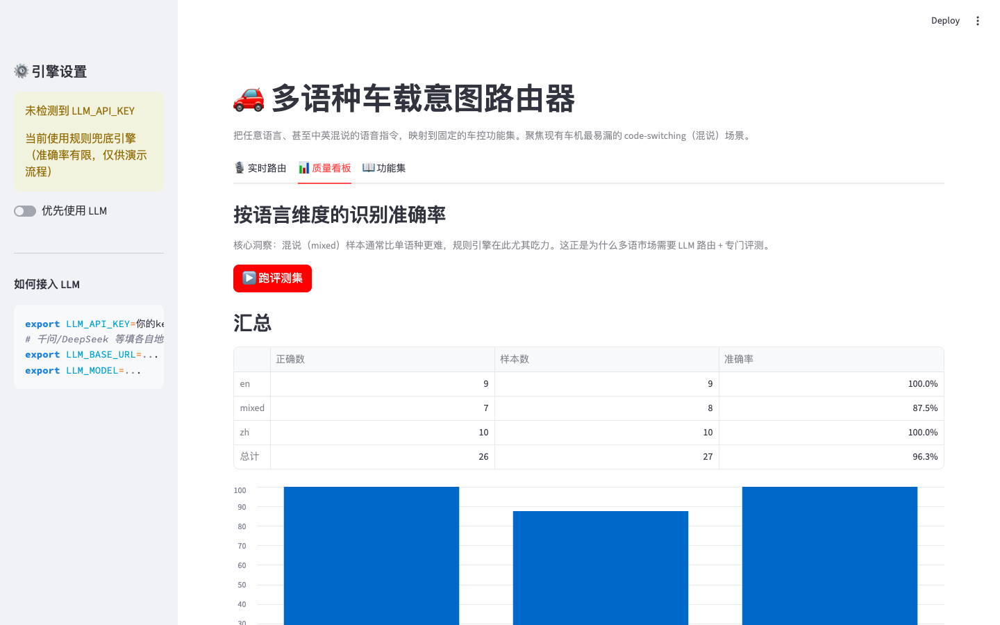
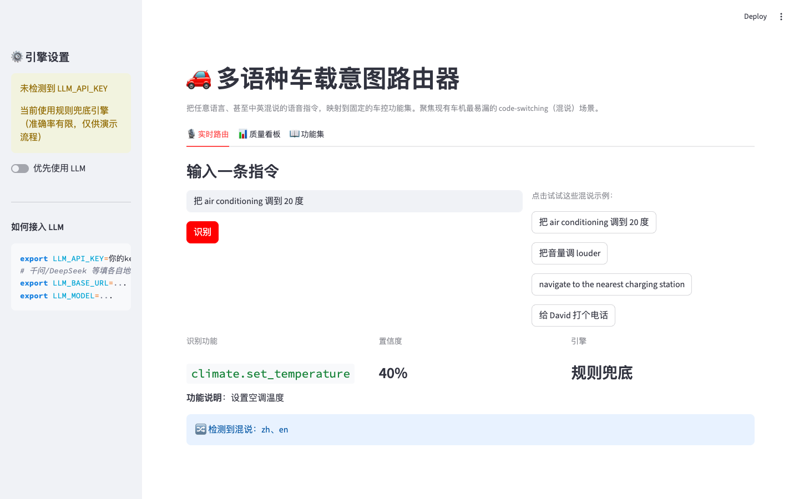
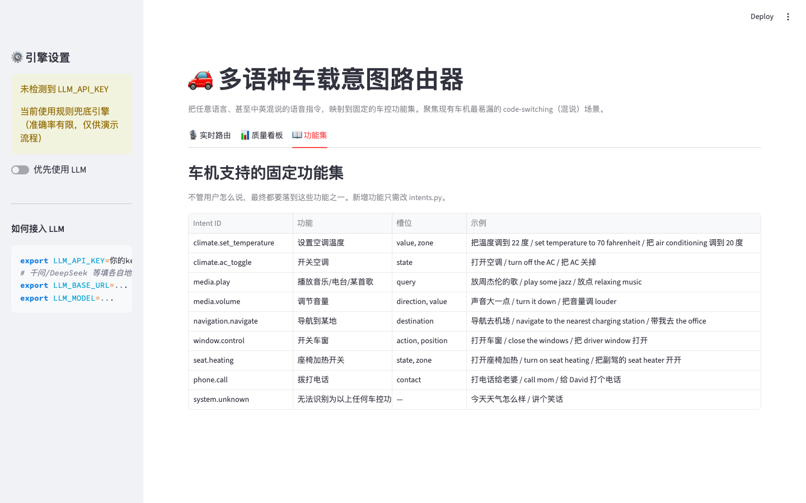

# 🚗 多语种车载意图路由器

> 让车机一次听懂中英混说的语音指令,把"多语种交互好不好"变成可量化的指标。

**针对的真实痛点**:多语种市场用户日常会说"把 **air conditioning** 调到 20 度",
现有车机大多按单一语言训练,一句话夹另一种语言就识别失败,用户被迫重说或切换语言,
这在出海车型上直接影响语音功能使用率。

**核心差异点**:聚焦现有方案普遍漏掉的 **code-switching(混说)** 场景,
并提供按语言维度切分的质量评测看板,这是 GitHub 上同类方案没人做的部分。

📄 完整产品文档见 [**PRD.md**](PRD.md)(竞品分析、指标设计、路线图、风险缓解)
💼 求职配套:[简历写法](docs/RESUME.md) · [部署指南](docs/DEPLOY.md) · [面试脚本](docs/INTERVIEW.md)

---

## 核心截图

### 1. 按语言维度的质量看板 — 用数据暴露混说场景的差距



> 规则引擎基线:单语种 100%、混说 87.5%、整体 96.3%——12.5pp 的 gap 正是引入 LLM 路由要收敛的目标。

### 2. 实时路由 — 输入混说指令,自动识别语言并映射到车控功能



### 3. 固定功能集 — 8 类车控功能,新增功能只需改一处



---

## 功能

- **实时路由**：输入任意语言/混说指令，输出 `intent + 槽位 + 置信度 + 检测到的语言`。
- **质量看板**：跑评测集，按 `中文 / 英文 / 混说` 三个维度看准确率，直观暴露混说场景的差距。
- **双引擎降级**：优先走 LLM；无 API key 或调用失败时自动降级到规则兜底，**保证任何环境都能演示**。
- **功能集可扩展**：新增一个车控功能只需改 `intents.py` 一处，路由逻辑无需改动。

## 快速开始

```bash
pip install -r requirements.txt

# (可选) 接入 LLM，不配也能跑（走规则引擎）
export LLM_API_KEY=你的key
export LLM_BASE_URL=...      # 千问/DeepSeek 等填各自地址，OpenAI 可省略
export LLM_MODEL=...         # 默认 gpt-4o-mini

streamlit run app.py
```

浏览器打开后即可使用三个 Tab：实时路由 / 质量看板 / 功能集。

## 在线部署

想要一个可点击访问的公开链接（放进简历比 GitHub 链接更有冲击力），
按 [`docs/DEPLOY.md`](docs/DEPLOY.md) 一键部署到 Streamlit Community Cloud，免费、约 10 分钟。

## 代码结构

| 文件 | 作用 |
|------|------|
| `intents.py` | **产品定义层**：车机能响应的固定功能集（intent + 槽位 + 多语种示例） |
| `router.py` | **核心**：LLM 路由 + 规则兜底，统一入口 `route(text)` |
| `eval_set.py` | **核心资产**：带标准答案的多语种测试集（含大量混说样本） |
| `evaluator.py` | 按语言维度跑评测、汇总准确率 |
| `app.py` | Streamlit Web Demo |

## 设计取舍（PM 视角）

- **为什么不自己训模型**：模型层（ASR/TTS/LLM）已经饱和，PM 的价值在场景定义、
  功能集设计、质量度量。本项目刻意把"产品定义"和"评测体系"做成一等公民。
- **为什么强调混说**：这是多语市场的真实痛点，也是和现有开源方案最大的差异点。
- **为什么要降级引擎**：车机对可用性要求极高，云端不可用时必须有本地兜底。

## 后续可扩展

- 评测集扩到数千条，按目标市场分语种维护。
- 增加方言、更多语种（日/德/阿等）。
- 接入真实 ASR（如 SenseVoice）做端到端语音 demo。
